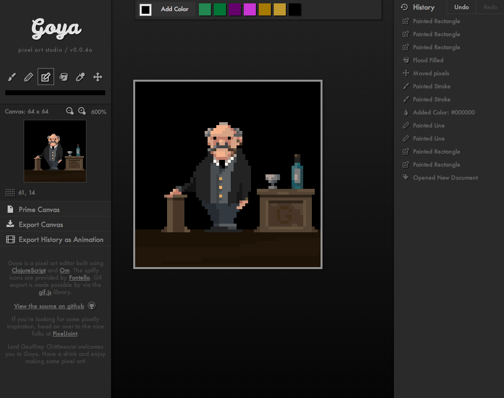

# Goya

A pixel-art editor built on ClojureScript and Om. It was largely inspired by the suprisingly short
code snippet required to implement undo functionality in David Nolen's Time Travel blog post
(http://swannodette.github.io/2013/12/31/time-travel/).

## Credits

Fontello.com provides the very nice and spiffy icon fonts which are used in the GUI.

## License

Copyright © 2014 Jack Schaedler

Distributed under the Eclipse Public License version 1.0
