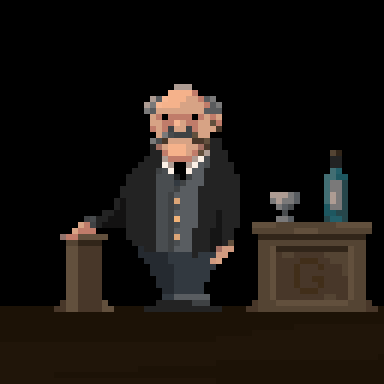

# Goya

A pixel-art editor built on ClojureScript and Om. It was largely inspired by the suprisingly short
code snippet required to implement undo functionality in David Nolen's Time Travel blog post
(http://swannodette.github.io/2013/12/31/time-travel/).

Play with it here:
http://jackschaedler.github.io/goya/.

## Export your entire history in animated form

Goya supports exporting your entire canvas history as an animated gif. Could be handy for demonstrating techniques or making tutorials about pixel-art.

## Credits

Fontello.com provides the very nice and spiffy icon fonts which are used in the GUI.

Gif export uses the gif.js library (https://github.com/jnordberg/gif.js)

## License

Copyright © 2014 Jack Schaedler

Distributed under the Eclipse Public License version 1.0
